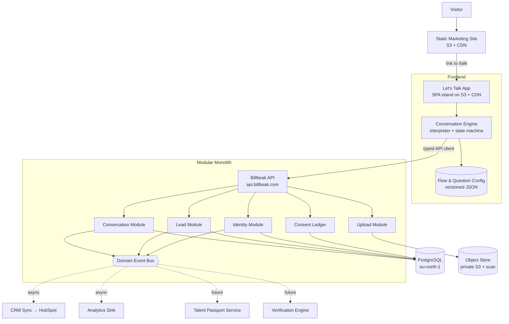
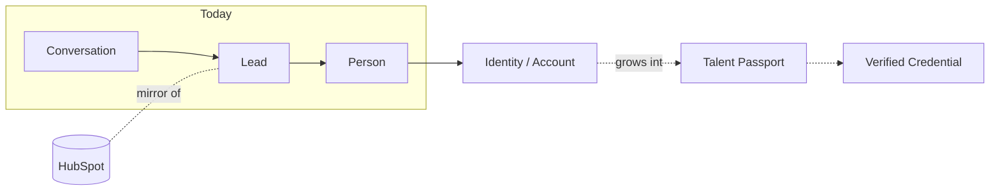
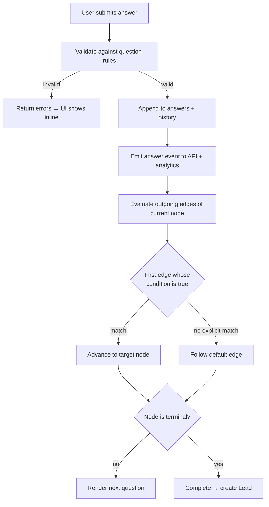
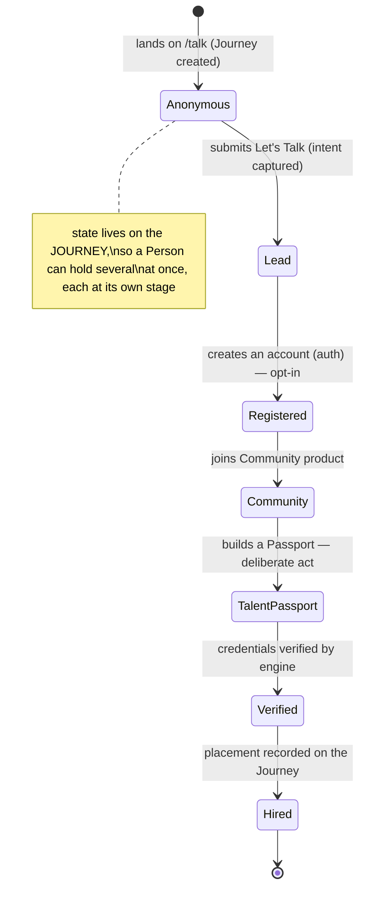
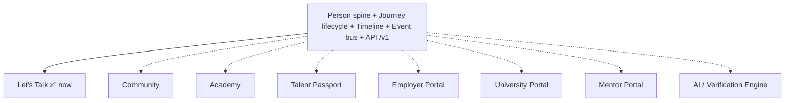

# Billbeak — "Let's Talk" Architecture Design Document

**Status:** Draft for approval · **Author:** Founding CTO / Principal Architect · **Date:** 2026-07-23
**Scope:** Architecture only. No production code is authored in this document.
**Decision horizon:** 10 years. Optimised for longevity, not for the demo.

---

## Revision Log

**R2 (2026-07-23) — Post-review amendments.** After a Staff-Engineer review, three changes were adopted. They supersede the original text wherever they conflict; affected sections are updated inline and tagged **[R2]**.

1. **Backend flipped from "TypeScript end-to-end" to FastAPI (Python).** Billbeak's long-term moat — Verification Engine, AI, ML, analytics — is Python-native. Keeping the primary API in Python removes a permanent language seam between the transactional core and the intelligence layer. The frontend's typed contract is preserved via **OpenAPI-generated TS clients** (a shared *schema*, not a shared *language*), which neutralised the original "shared types" argument for a JS backend. See §9, §10.
2. **`Journey` entity introduced** between `Person` and `Conversation`. A Journey is a purposeful, stateful, multi-instance **business arc** for a Person (seeking-hiring, becoming-a-mentor, university-partnership). The identity **lifecycle state moves off `Person` onto `Journey`**. Distinct from `Flow` (static config). See §4, §5, §11.
3. **`Timeline` promoted to a core module.** A curated, durable, verifiable sequence of human-meaningful milestones (`JoinedBillbeak`, `WorkshopAttended`, `ProjectUploaded`, `Verified`, `Hired`) — distinct from high-volume analytics `interaction_event`s. This is the platform's competitive moat: a verifiable longitudinal identity graph and the substrate for the Passport and AI. See §4, §5, §15, §17.

*Note:* the Conversation Engine (frontend TypeScript) is unaffected by the backend-language change and is built as specified.

---

## 0. Grounding — What Actually Exists Today

Before designing anything, the current repository was studied. This is not a Next.js app. The reality:

| Concern | Current State |
|---|---|
| **Framework** | None. Static, hand-authored multi-page HTML (`index.html`, `academy.html`, `community.html`, `corporate.html`, `talent.html`, several `index-*` variants). |
| **Build system** | None. No `package.json`, no bundler, no transpile step. Files are edited and shipped as-is. |
| **Runtime libs** | jQuery 3.7, Bootstrap, Swiper, a stack of jQuery plugins (Orisa template lineage) + custom vanilla-JS effects (`at-hero-fx.js`, `at-cursor.js`, slideshow engines). |
| **Routing** | Filesystem routing over S3 (one `.html` per URL). No client router. |
| **Styling** | Vendor CSS + hand-written `assets/css/main.css`, `ethereal.css`. Global cascade, no CSS modules. |
| **Backend** | **None.** There is no server, no database, no API today. |
| **Deployment** | GitHub Actions on push to `main` → `aws s3 sync . s3://billbeak.com` in **eu-north-1** (Stockholm). `index.html` re-uploaded with `no-cache`. |
| **Data residency** | EU (Stockholm) is already the de-facto home. This is a gift for GDPR and India DPDP planning — keep it. |

**The single most important architectural fact:** there is no backend and no build pipeline to reuse. "Let's Talk" is not being *added* to an application — it is the **first real application** this organisation will own. Everything downstream (Identity, Talent Passport, Portals) hangs off decisions made here. That is why we design the spine now and build a narrow slice.

---

## 1. High-Level Architecture

### Where does "Let's Talk" live?

Three viable options were weighed:

| Option | Description | Verdict |
|---|---|---|
| **A. Inline into the static site** | Vanilla JS + jQuery in the existing pages, POST to a form endpoint. | ❌ Rejected. A branching conversation engine with validation, uploads, resumable state, consent and versioned config cannot live sanely in jQuery global scope. It would be technical debt on day one. |
| **B. Isolated app mounted at `/talk`** | A self-contained, modern-toolchain mini-SPA, statically exported, deployed into the **same S3 bucket** under `/talk/*`, talking to a **separate serverless API**. | ✅ **Recommended.** |
| **C. Migrate the whole site to Next.js now** | Rebuild all marketing pages in a framework. | ❌ Rejected *now* (noted as an eventual path). Enormous, high-risk, and irrelevant to the goal. Do not hold the front door hostage to a marketing-site rewrite. |

### Recommendation: **Option B — the Islands approach**

- The marketing site stays exactly as it is: fast static HTML on S3. Zero migration risk.
- "Let's Talk" is a **decoupled application** served at `billbeak.com/talk`, built with its own modern toolchain (see §9), and **owns its own bundle, its own build, its own deploy**.
- It communicates with a **standalone backend API** (`api.billbeak.com`) — not with the static site.
- The static pages link to `/talk`. That's the entire coupling surface. One href.

```
billbeak.com/                 → static marketing (unchanged, S3)
billbeak.com/talk             → Let's Talk app (new SPA island, S3 under /talk/)
api.billbeak.com/v1/...       → Billbeak API (new serverless backend)
```

**Pros:** Blast radius is isolated — a bug in `/talk` cannot break the homepage and vice versa. Independent deploy cadence. The conversation app can adopt TypeScript, a component model, and tests without forcing them on legacy pages. It is the seed of the future Identity Platform *without* dragging the marketing site along.

**Cons:** Two toolchains coexist for a while (static + built app). Shared design tokens must be deliberately synced (§16). Accepted — this is a small, well-understood cost against a large, well-understood benefit.

**Rule:** `/talk` never imports jQuery, Bootstrap, or any legacy vendor script. Clean-room start.

---

## 2. Folder Structure

Monorepo, so shared types live in exactly one place and the frontend and backend cannot drift. The existing static site is left untouched under `web-static/` (or stays at root — see migration note).

```
billbeak/
├─ web-static/                    # existing marketing site (moved as-is, or left at root for now)
│
├─ packages/
│  └─ conversation-engine/        # [R2] Conversation Engine — standalone, reusable package
│     │                           # (moved OUT of apps/talk so portals & future apps reuse it)
│     ├─ src/
│     │  ├─ machine/              # finite state machine (states/transitions)
│     │  ├─ engine/               # ConversationEngine — public API, orchestrates machine + adapters
│     │  ├─ conditions/           # predicate evaluation for branching
│     │  ├─ validation/           # validator registry + built-in validators
│     │  ├─ questions/            # question-type registry (validate/serialize, NOT rendering)
│     │  ├─ progress/             # progress calculation over the reachable path
│     │  ├─ persistence/          # PersistenceAdapter interface + Memory/LocalStorage/IndexedDB
│     │  ├─ analytics/            # AnalyticsAdapter interface + reference sinks
│     │  ├─ uploads/              # UploadProvider interface + reference
│     │  └─ types/               # public engine types (framework-agnostic)
│     └─ src/**/*.test.ts        # unit tests (native node:test)
│
├─ apps/
│  └─ talk/                       # the "Let's Talk" island (frontend)
│     ├─ src/
│     │  ├─ ui/                   # presentation only — dumb, driven by the engine (imports the package)
│     │  │  ├─ questions/         # one renderer per question TYPE (select, text, upload…)
│     │  │  ├─ shell/             # progress, back button, transitions, layout
│     │  │  └─ theme/             # design tokens mirrored from the marketing brand
│     │  ├─ animations/           # motion primitives (question enter/exit, reveal)
│     │  ├─ hooks/                # useConversation, useAutosave, useUpload, useAnalytics
│     │  ├─ api/                  # typed client to api.billbeak.com (no logic, just transport)
│     │  ├─ state/                # local session store + persistence adapter
│     │  └─ utils/                # formatters, id helpers, guards
│     ├─ public/
│     └─ index.html
│
├─ config/
│  └─ conversations/              # QUESTION CONFIGURATION — data, not code
│     ├─ flows/                   # one file per journey: employer, university, student…
│     │  ├─ employer.flow.json
│     │  ├─ university.flow.json
│     │  ├─ student.flow.json
│     │  └─ _root.flow.json       # the first "which door are you?" question
│     ├─ questions/               # reusable question definitions referenced by flows
│     └─ schema/                  # JSON Schema that every flow/question is validated against
│
├─ services/
│  └─ api/                        # BACKEND — modular monolith
│     ├─ src/
│     │  ├─ modules/
│     │  │  ├─ conversation/      # sessions, answers, resume
│     │  │  ├─ journey/           # [R2] Person's purposeful tracks + lifecycle state
│     │  │  ├─ timeline/          # [R2] curated, verifiable milestone events (moat module)
│     │  │  ├─ lead/              # lead capture, scoring, routing
│     │  │  ├─ identity/          # Person spine + account
│     │  │  ├─ organisation/      # employer / university records
│     │  │  ├─ consent/           # append-only consent ledger
│     │  │  ├─ upload/            # presigned URLs, scan orchestration
│     │  │  ├─ crm/               # outbound HubSpot sync (adapter)
│     │  │  └─ analytics/         # high-volume telemetry ingestion (distinct from timeline)
│     │  ├─ http/                 # FastAPI route handlers, request validation, versioning [R2]
│     │  ├─ schemas/              # Pydantic models — source of truth for the OpenAPI contract [R2]
│     │  ├─ db/                   # schema, migrations, repositories
│     │  ├─ events/               # internal domain-event bus (in-proc now, queue later)
│     │  └─ platform/             # config, logging, auth, rate-limit, error types
│     └─ migrations/
│
├─ packages/
│  └─ api-client/                 # [R2] TS wire contract GENERATED from the API's OpenAPI spec
│     └─ src/                     # typed DTOs + fetch client — consumed by apps/ (not hand-written)
│
└─ infra/                         # IaC — S3, CDN, API, DB, buckets, secrets (Terraform/CDK)
```

**Why each top-level folder exists:**

- **`web-static/`** — legacy marketing, quarantined so it can rot or be rewritten independently.
- **`packages/conversation-engine/`** — **[R2]** the headless engine as a standalone, reusable package (logic, no rendering). Split hard from any UI. Unit-testable without a DOM; re-skinnable and re-platformable without touching decision logic. Reused by `apps/talk` today and by future portals/workflows.
- **`apps/talk/`** — the UI island. Pure presentation, driven by the engine package.
- **`config/conversations/`** — questions and journeys live here **as data**. Adding "Investor" or "Government" later is a new JSON file, not a code change (§7).
- **`services/api/`** — **[R2]** one FastAPI (Python) deployable, internally modular. Bounded contexts as folders today; extractable to services later without a rewrite.
- **`packages/api-client/`** — **[R2]** the wire contract, **generated** from the API's OpenAPI spec (whose source of truth is the Pydantic `schemas/`). The frontend imports typed DTOs; the contract cannot silently drift because it is regenerated, not hand-copied.
- **`infra/`** — everything reproducible. No click-ops in the AWS console.

---

## 3. System Architecture

### 3.1 Request / data flow



### 3.2 Identity as the spine (conceptual)



**Relationships explained:**

- **Site → Talk**: a single link. The static site never talks to the API.
- **Talk → Engine → Config**: the UI never decides what comes next; the **engine** interprets **config** and tells the UI what to render. Questions are data.
- **Engine → API**: the frontend persists answers and creates leads through one typed client. No business rules on the client.
- **API → Modules → DB**: each module owns its tables. Cross-module talk goes through the **event bus**, never direct table reads. This is what makes future extraction to separate services cheap.
- **Event Bus → CRM / Analytics / (future) Passport / Verification**: everything downstream subscribes to domain events (`LeadCreated`, `ConsentGranted`, `ConversationCompleted`). New consumers attach without touching producers — this is the extensibility contract.
- **Person is the spine.** A `Conversation` produces a `Lead`; a `Lead` resolves to a `Person`; a `Person` may *later* acquire an `Identity`, and *much later* a `Talent Passport`. These are distinct entities on purpose (§11).

---

## 4. Entity Design (business first, tables later)

Entities are modelled as the business sees them. No SQL yet.

| Entity | What it represents | Why it must exist as its own thing |
|---|---|---|
| **Person** | A real human or the shadow of one, independent of any single interaction. | The permanent identity spine. Everything else attaches to a Person. A Person can exist before they ever register and can span many journeys, conversations, leads, and eventually a Passport. Merging duplicates is a first-class future need — only possible if Person is separate. **[R2]** Lifecycle state no longer lives here — it moved to `Journey`. |
| **Journey** **[R2]** | A purposeful, stateful **track** a Person is on (seeking-hiring, becoming-a-mentor, university-partnership). A Person may have several concurrently. | Models the multi-track reality: the same Person is legitimately at different stages in different pursuits. **Owns the lifecycle state** and aggregates the Conversations, Leads, and milestones for that track. Distinct from `Flow` (static config) — a Journey is the runtime business arc; a Flow is a design-time question graph. It is the natural cohort unit for analytics. |
| **Organisation** | An employer, university, or corporate — the entity a Person may act on behalf of. | B2B journeys are about companies, not just people. Multiple Persons can belong to one Organisation. Deduplicating by domain (e.g. `@acme.com`) requires Organisation to be its own entity. |
| **Conversation** | One run through "Let's Talk" — the session, its chosen journey, and its progress. | The unit of experience and of analytics. Must survive refresh, abandonment, and resume. Distinct from the Lead it may or may not produce. |
| **Question** | A definition of something we ask — type, prompt, options, validation. | Reusable across flows. Must be versioned so historical answers remain interpretable when wording changes. |
| **Answer** | A Person's response to one Question within one Conversation. | The atomic data unit. Stored as an **append-only event** (§5) so we keep *what they said and when*, including edits — never a lossy overwrite. |
| **Flow** | An ordered, branching journey (Employer, University, Student…). | The journey is data. New audiences = new Flows, no code change. Versioned so in-flight conversations don't shift under users. |
| **Lead** | A qualified intent captured from a completed/partial Conversation. | The commercial artifact — what sales/partnerships act on. Separate from Person because one Person can generate many Leads over years. |
| **Consent** | A specific, timestamped permission (marketing, data processing, terms). | Legally load-bearing. Must be **immutable and append-only** for GDPR/DPDP proof. Never a boolean on Person. |
| **Upload** | A file a Person submitted (resume, proposal, image) + its metadata and scan status. | Files carry risk (malware, PII) and lifecycle (retention, deletion). Metadata must be queryable independent of the bytes. |
| **Role** | The capacity a Person acted in (candidate, employer contact, mentor…). | The same Person is an employer today and a candidate next year. Role is contextual, not a property of Person. |
| **Interaction / Event** | An immutable record of a low-level thing that happened (question answered, back pressed, abandoned). | The analytics and audit backbone. High-volume, machine-facing. Also a behavioural signal for future AI. **Distinct from Timeline** — see below. |
| **Timeline Event** **[R2]** | A curated, durable, human-meaningful **milestone** in a Person's story (`JoinedBillbeak`, `WorkshopAttended`, `ProjectUploaded`, `MentorReviewed`, `Verified`, `Hired`). | **The competitive moat.** Turns Billbeak from a directory into a *verifiable longitudinal identity graph*. Each event can carry provenance and a verification status, so the Talent Passport becomes an evidenced narrative rather than a self-declared CV — the thing incumbents structurally cannot replicate, and the training substrate for the Verification/AI layer. Curated and permanent, unlike the high-volume Interaction stream. |
| **Identity / Account** | Authentication + authorization surface once a Person registers. | Deliberately *later* than Person. Most visitors never authenticate; forcing Identity early corrupts the model (§11). |

---

## 5. Database Design

**Engine: PostgreSQL** (managed, eu-north-1). Rationale in §9. Below is the *shape*, not migrations.

### Cross-cutting conventions (applied to every table)

- **Primary keys:** UUID v7 (time-ordered → index-friendly, non-guessable, safe to expose, mergeable across systems). Never auto-increment ints.
- **Audit fields:** `created_at`, `updated_at`, `created_by`, `updated_by` on every row.
- **Soft delete:** `deleted_at TIMESTAMPTZ NULL`. Hard delete only via a GDPR/DPDP erasure job that tombstones and purges PII deliberately.
- **Versioning:** definition tables (`question`, `flow`) are **immutable-per-version**; edits create a new version row, referenced by version id. Answers point at the exact version they were shown.
- **History:** mutable business rows (`lead`, `person`) get a `*_history` audit table written by trigger, or use temporal columns. Never lose a prior state.
- **Extensibility:** each core table carries a `metadata JSONB` column for attributes we haven't imagined yet — structured columns for what we query, JSONB for the long tail. Add a GIN index when a JSONB key becomes hot.

### Core tables (sketch)

```
person
  id (uuidv7 pk) · primary_email (citext, nullable, unique-when-present)
  primary_phone (nullable) · display_name
  metadata jsonb · audit · deleted_at
  -- [R2] lifecycle_state REMOVED — it lives on journey now

journey                           -- [R2] a Person's purposeful track; owns lifecycle
  id (uuidv7 pk) · person_id fk → person
  track (enum: hiring|mentorship|university_partnership|corporate|…)
  lifecycle_state (enum: anonymous|lead|registered|community|passport|verified|hired)
  status (active|dormant|closed) · started_at · last_activity_at
  metadata jsonb · audit · deleted_at
  INDEX (person_id) · INDEX (lifecycle_state)
  -- a Person may have MANY journeys, at different lifecycle states

organisation
  id pk · legal_name · primary_domain (citext) · type (employer|university|corporate)
  country · metadata jsonb · audit · deleted_at
  INDEX (primary_domain)

person_organisation            -- many-to-many with role in context
  person_id fk → person · organisation_id fk → organisation
  role (enum) · is_primary bool · audit
  PK (person_id, organisation_id, role)

conversation
  id pk · person_id fk (nullable until identified) · journey_id fk (nullable until identified) · flow_key · flow_version
  status (in_progress|completed|abandoned) · resume_token (hashed)
  started_at · last_activity_at · completed_at
  metadata jsonb (utm, referrer, device) · audit
  INDEX (status, last_activity_at)   -- for abandonment sweeps

flow                              -- versioned journey definition (mirror of config)
  id pk · key (e.g. 'employer') · version int · definition jsonb
  is_active bool · published_at · audit
  UNIQUE (key, version)

question                          -- versioned question definition
  id pk · key · version int · type (enum) · definition jsonb
  UNIQUE (key, version)

answer_event                      -- APPEND ONLY. never updated, never deleted (except erasure)
  id (uuidv7 pk) · conversation_id fk · question_key · question_version
  value jsonb · is_current bool · answered_at · audit
  INDEX (conversation_id, question_key)
  -- edits insert a new row; is_current recomputed. full history retained.

lead
  id pk · person_id fk · organisation_id fk (nullable) · conversation_id fk
  journey (enum) · score int · status (new|routed|qualified|closed)
  routed_to · payload jsonb (denormalised snapshot for sales) · audit · deleted_at
  INDEX (status, created_at)

consent                           -- APPEND ONLY ledger, legally immutable
  id pk · person_id fk (nullable) · conversation_id fk
  purpose (enum: data_processing|marketing|terms|…)
  granted bool · policy_version · source · ip_hash · user_agent
  occurred_at · audit
  -- withdrawal is a NEW row with granted=false, never a mutation

upload
  id pk · person_id fk (nullable) · conversation_id fk · question_key
  object_key (private bucket) · filename · content_type · size_bytes
  scan_status (pending|clean|infected|failed) · sha256
  retention_expires_at · metadata jsonb · audit · deleted_at
  INDEX (scan_status)

interaction_event                 -- analytics/audit substrate, append only, high volume
  id pk · conversation_id fk (nullable) · person_id fk (nullable)
  event_type · question_key (nullable) · properties jsonb
  occurred_at · session_id
  INDEX (event_type, occurred_at)
  -- candidate for partitioning by month; may move to a warehouse later

timeline_event                    -- [R2] MOAT: curated, durable, verifiable milestones
  id (uuidv7 pk) · person_id fk → person · journey_id fk (nullable)
  type (enum: joined|workshop_registered|workshop_attended|project_uploaded|
        github_connected|portfolio_created|mentor_review|interview|verification|hired|…)
  title · occurred_at · source (module that produced it)
  verification_status (unverified|pending|verified|revoked)
  evidence jsonb (provenance: refs, actor, artifacts) · visibility (private|community|public)
  metadata jsonb · audit
  INDEX (person_id, occurred_at) · INDEX (type)
  -- append-mostly; verification_status is the only mutable field, itself audited

identity_account                  -- created ONLY on real registration (§11)
  id pk · person_id fk (unique) · auth_provider · auth_subject
  email_verified_at · status · audit
```

**Ten-year decisions baked in:** append-only answers and consent (auditability + AI signal), version pinning on definitions (historical integrity), UUID v7 (mergeability across future services), JSONB escape hatches (schema evolution without migrations for the long tail), and per-module table ownership (clean future extraction).

---

## 6. Conversation Engine

The engine is a **config interpreter over a directed graph**, living in `apps/talk/src/engine/`, written as **pure TypeScript with zero UI and zero framework imports**. It can run in a unit test, in a worker, or (later) on the server for validation.

### Internal model

- A **Flow** is a directed graph. **Nodes** are questions (or logic/terminal nodes). **Edges** carry optional **conditions**.
- The engine holds a **machine state**: `{ flowKey, flowVersion, currentNodeId, answers, history[], status }`.
- Core operations:
  - `start(flow)` → resolves the entry node.
  - `answer(nodeId, value)` → validates, records into `answers`, pushes to `history`, computes the **next node** by evaluating outgoing edge conditions in order (first match wins; a default edge is required for total-ness).
  - `back()` → pops `history`, restores prior node and prior answers (answers are preserved, so returning shows what they typed).
  - `skip(nodeId)` → only if the node is `optional`; records a skip event, advances.
  - `progress()` → derived from graph depth of the *reachable* path given current answers, not a naive count (branching means the denominator changes — compute against the current path's remaining nodes).

### Supported question types (renderers in `ui/questions/`, contracts in `shared/`)

`single_select · multi_select · text · long_text · email · phone · date · upload`

Each type declares: its value shape, its validators, and how it renders. Adding a new type = new renderer + entry in the type registry. The engine treats all types uniformly — it only knows "validate, store, branch".

### Branching, validation, next-question — how it actually decides



**Conditions** are declarative predicates evaluated against the answer state (e.g. `answers.audience == 'employer'`, `answers.team_size in ['50-200','200+']`). They live in config as data (`predicates.ts` only supplies the evaluator), so branching logic is authored, not compiled. **The engine never contains any journey-specific `if`.**

---

## 7. Question Configuration

Questions and journeys are **data in `config/conversations/`**, validated against JSON Schema in CI. No question ever lives inside a component.

### Structure

- **`questions/*.json`** — reusable atomic question definitions (key, type, prompt, help, options, validation, optional flag).
- **`flows/*.flow.json`** — a journey: an ordered graph of nodes referencing questions, plus edges with conditions. `_root.flow.json` is the opening "which door are you?" that branches into every other flow.
- **`schema/`** — JSON Schema for both. **CI rejects any config that doesn't validate**, so a malformed flow can never ship.

### Illustrative shape (data, not code)

```
question: audience
  type: single_select
  prompt: "What brings you to Billbeak?"
  options: [employer, university, corporate, student, candidate, join_us, other]

flow: _root
  entry: audience
  edges:
    - when: answers.audience == 'employer'   → goto employer.entry
    - when: answers.audience == 'university'  → goto university.entry
    - default                                 → goto generic.entry
```

### Why this satisfies "add audiences without touching frontend code"

Today's Employer/University/Student flows and **tomorrow's Investor / Government / Media / Partner** flows are all the same thing: a new `*.flow.json` (and maybe new `questions`). Ship a JSON file → new journey live. The frontend bundle does not change. This is the difference between a product and a pile of forms.

**Where config is served from:** authored in-repo (versioned, reviewable, diff-able), **published into the `flow`/`question` DB tables** at deploy. The app fetches active flow definitions from the API (cached at the CDN edge), so config can be updated without a frontend redeploy while still being git-reviewed.

---

## 8. State Management

Three tiers, each with a clear job:

1. **In-memory (engine state):** the authoritative live state during the session — current node, answers, history. Drives the UI.
2. **Local persistence (resilience):** every answer is mirrored to `localStorage`/`IndexedDB` under a `conversationId`. **Refresh recovers instantly and offline-first** — the user never loses progress even before the server has acknowledged anything.
3. **Server persistence (durability + resume across devices):** answers are debounced-synced to the API as `answer_event`s. The conversation row holds a hashed `resume_token`.

### Unfinished conversations

- On first meaningful interaction, a `conversation` is created server-side (status `in_progress`) and a `resume_token` is issued.
- **Same device refresh:** local store rehydrates the engine — zero round-trip.
- **Cross-device / returning later:** a resume link (magic token) rehydrates from the server.
- **Abandonment:** a scheduled sweep marks conversations with no activity past a threshold as `abandoned`, which fires an analytics event and (if an email was captured with consent) can trigger a nudge.

**Privacy note:** local persistence must respect consent — if a user hasn't consented to processing and later clears/declines, the local copy and any server copy are purged. Persistence is a feature, not a loophole (§14).

---

## 9. Backend Architecture

### Recommendation **[R2 — REVISED]**: **A FastAPI (Python) modular monolith on serverless, PostgreSQL, in eu-north-1.**

> **This reverses the original "TypeScript end-to-end" call.** The original justification — sharing types across the wire — is preserved by other means (below), so it no longer outweighs the Python gravity of Billbeak's long-term moat.

**Language: Python (FastAPI + Pydantic v2).** Billbeak's ten-year differentiators — the **Verification Engine, AI, ML, document/resume parsing, analytics/data-science** — are all Python-native. Choosing a JS backend would put a permanent language seam between the transactional core and the intelligence layer, precisely the two parts that most need to share domain models (a `Person`, an `Answer`, a `Credential`). FastAPI keeps the core and the moat in one language, one hiring pool (large in India, and the *same* pool as the ML roles we must hire anyway), and one library ecosystem. Pydantic v2 gives best-in-class runtime validation and a typed request/response layer.

**The "shared types" concern is answered without a JS backend.** FastAPI auto-emits an **OpenAPI** spec from the Pydantic models; a codegen step produces the typed TS client in `packages/api-client`. The frontend gets a compile-checked contract that is *generated, not hand-maintained*, so it cannot silently drift. We needed a shared **schema**, not a shared **language** — and OpenAPI is that schema.

**Why not NestJS (the strongest challenger):** Nest's single-language DX is real, but it only pays off if AI/ML stays permanently in *separate* services, re-duplicating the domain models across the language boundary anyway. For a company whose core product *is* verification and talent intelligence, betting the primary API on the ML-native language is the lower-risk ten-year choice. Performance is a wash — both are I/O-bound here; the database is the bottleneck, not the runtime.

**Serverless note:** Python cold starts are heavier than Node's. Mitigations: keep the API package lean, use provisioned concurrency on hot paths, and (as designed) render the first question from static/edge with no API dependency so cold starts never sit on the critical answering path. If cold starts ever bite, the same FastAPI app runs unchanged on a container/App Runner — the framework choice does not lock us to Lambda.

**Shape: modular monolith, not microservices.** One deployable with hard module boundaries (`conversation`, `lead`, `identity`, `consent`, `upload`, `crm`, `analytics`) that communicate through an in-process **domain event bus**. This gives the *organisational* benefits of services (bounded contexts, clear ownership) without the *operational* tax (distributed transactions, network failure modes, deploy orchestration) that would be premature for a front door. When a module genuinely needs independent scaling (e.g. the future Verification Engine), the event boundary is already there — extraction is a lift, not a rewrite.

**Runtime: serverless (AWS Lambda + API Gateway, or Lambda Function URLs).** The organisation already lives on AWS/S3 in eu-north-1. Serverless means the front door costs ~nothing at idle, scales to spikes (a campaign, a press hit) without capacity planning, and keeps ops surface minimal for a small team. Data stays in-region for residency.

**Database: PostgreSQL (Aurora Serverless v2 or a managed Postgres such as Neon/RDS), eu-north-1.** Relational because identity, organisations, leads and consent are *deeply relational and audited* — exactly Postgres's strength — while JSONB covers the flexible/long-tail fields so we get document-store flexibility without giving up integrity, transactions, and mergeable keys. A NoSQL store here would trade away the referential integrity that an Identity Platform's entire value depends on.

### Alternatives considered

| Alternative | Why not (now) |
|---|---|
| **NestJS (TypeScript)** **[R2]** | Strong single-language DX, but re-duplicates domain models across a language boundary once ML/verification (Python) becomes central — which for Billbeak it is, from early on. The shared-types win is obtainable via OpenAPI codegen without paying that cost. |
| **Next.js full-stack app** | Couples backend lifecycle to a React frontend and nudges toward Vercel lock-in. We want the API independent of any one UI (portals, mobile, partners will all consume it). Overkill for the marketing site, wrong seam for a platform. |
| **Microservices from day one** | Distributed complexity with no scale to justify it. Guaranteed to slow the first year and over-fit assumptions we haven't tested. |
| **BaaS (Supabase/Firebase) as the whole backend** | Great for speed, but the Identity Platform is the *crown jewel* — we must own identity, consent, and the data model outright. Fine to use managed Postgres; not fine to outsource the domain logic and lifecycle. |
| **DynamoDB / NoSQL primary** | Loses relational integrity and ad-hoc query power that leads, orgs, and audit require. Access patterns here are not yet frozen — premature to model around them. |

---

## 10. API Design

REST over HTTPS, JSON, **explicitly versioned via URL prefix `/v1/`** (simplest to reason about, cache, and route; a `/v2/` can run side-by-side during migrations, `/v1/` deprecated on a published sunset schedule). All writes are idempotent where possible (client-supplied idempotency keys on create). **[R2]** Contracts are the Pydantic `schemas/` on the API, published as OpenAPI and codegen'd into the `packages/api-client` TS types.

*Design only — no implementation.*

| Method & Path | Purpose | Request (essentials) | Response (essentials) |
|---|---|---|---|
| `POST /v1/conversations` | Start a conversation | `flowKey`, capture context (utm, referrer) | `conversationId`, `resumeToken`, `flow` (active version), entry node |
| `GET /v1/conversations/{id}` | Resume | resume token (header) | current state, answers, next node |
| `POST /v1/conversations/{id}/answers` | Record an answer + get next step | `questionKey`, `questionVersion`, `value`, idempotency key | validation result, `nextNode` or `completed` |
| `POST /v1/conversations/{id}/back` | Step back | — | prior node + preserved answers |
| `POST /v1/conversations/{id}/complete` | Finalise → create Lead | — | `leadId`, outcome/next-step content |
| `GET /v1/flows/{key}` | Fetch active flow definition | version (optional) | flow graph + referenced questions (edge-cached) |
| `POST /v1/uploads/presign` | Get a presigned PUT for a file | `filename`, `contentType`, `size`, `questionKey` | `uploadUrl`, `objectKey`, constraints |
| `POST /v1/uploads/{id}/complete` | Register upload, trigger scan | `objectKey`, `sha256` | `uploadId`, `scanStatus: pending` |
| `POST /v1/consent` | Record a consent decision | `purpose`, `granted`, `policyVersion` | consent receipt id |
| `POST /v1/events` | Batch analytics events | `[{type, questionKey?, properties, occurredAt}]` | `202 Accepted` |
| `GET /v1/persons/{id}/journeys` **[R2]** | List a Person's tracks + lifecycle states | person id (authorised) | `[{journeyId, track, lifecycleState, status}]` |
| `GET /v1/persons/{id}/timeline` **[R2]** | The verifiable milestone timeline | person id, visibility filter | `[{type, title, occurredAt, verificationStatus, evidence}]` |
| `POST /v1/timeline` **[R2]** | Append a milestone (internal/module-authenticated) | `personId`, `journeyId?`, `type`, `title`, `evidence` | `timelineEventId` |
| `GET /v1/health` | Liveness/readiness | — | status |

**Cross-cutting:** every response carries a request id; errors use a stable envelope (`code`, `message`, `details[]`, `requestId`). Rate limits and validation applied at the `http/` layer before any module is touched (§14).

---

## 11. Identity Strategy

**The load-bearing principle: filling in "Let's Talk" does NOT create a Talent Passport, and does NOT create an account. It creates a Lead attached to a Person, within a Journey.** Identity is earned in stages, and each stage is an explicit, consented transition — never an accident of form submission.

**[R2] The lifecycle belongs to the `Journey`, not the `Person`.** A Person can be `verified`/`hired` on their hiring Journey while simultaneously `lead` on a brand-new mentorship Journey. Modelling the lifecycle per-Journey is what makes multi-track reality representable without contradiction.



| Stage | What exists | What triggers the next step |
|---|---|---|
| **Anonymous** | A `conversation` with no `person_id`; maybe local state only. | Meaningful engagement (an answer) → server-side conversation. |
| **Lead** | A `Person` (possibly shadow, no login) + a `Lead`. PII only with consent. | The Person chooses to register. |
| **Registered** | An `identity_account` linked to the Person. Auth exists now, not before. | Opting into a product surface (Community). |
| **Community** | Membership + profile. | A *deliberate* decision to build a Passport. |
| **Talent Passport** | A structured, owned professional identity. | Submitting credentials for verification. |
| **Verified** | Passport with verified claims from the Verification Engine. | — |

**Why this matters:** an Identity Platform's trust depends on the difference between "someone we heard from" and "someone who is who they say they are." Collapsing those (auto-minting Passports from a contact form) would poison the data set permanently and create legal exposure. The `Person` spine lets a human move up these stages over *years*, across multiple conversations, while everything they ever did remains attributable and mergeable. Identity **evolves**; it is never assumed.

---

## 12. CRM Integration

**Do not build a CRM.** Sales pipeline tooling is a solved commodity and not Billbeak's differentiator.

**Do own the system of record.** `Person`, `Lead`, `Consent`, and `Conversation` are Billbeak's crown jewels and stay in the Billbeak database, full stop.

**Sync outbound to HubSpot** as a subscriber to domain events (`LeadCreated`, `LeadQualified`) via the `crm` module — a thin adapter, one-way by default (Billbeak → HubSpot). HubSpot becomes the *sales workspace*; it is never the source of truth for identity or consent.

| Stays in Billbeak (source of truth) | Lives in / mirrored to CRM |
|---|---|
| Person / Identity spine & lifecycle | Contact & company records for sales |
| Consent ledger (legal record) | Deal/pipeline stages, tasks, notes |
| Conversations & answer history | Sales activity, email threads |
| Leads (canonical) | Lead as a workable pipeline object |

If a two-way sync is ever needed (e.g. sales marks a lead qualified), it comes back as an *event into Billbeak* that updates `lead.status` — the CRM never mutates identity or consent. This keeps the legal and identity data uncontaminated by CRM churn.

---

## 13. File Upload Strategy

Files (resumes, proposals, images) are **never** sent through the API server. Flow:

1. **Presign:** client calls `POST /v1/uploads/presign` with filename/type/size. Server enforces an allow-list (type + max size) and returns a short-lived presigned PUT to a **private** S3 bucket (never public-read).
2. **Direct upload:** browser PUTs straight to S3. The API never handles the bytes → no server memory/timeout risk, scales for free.
3. **Register + scan:** client calls `.../complete`; an S3 event triggers an async **antivirus/malware scan** (e.g. a scanning Lambda / ClamAV). `scan_status` starts `pending`.
4. **Quarantine until clean:** a file is invisible to any consumer (sales, Passport) until `scan_status = clean`. `infected` → deleted + alert.
5. **Metadata in Postgres** (`upload` table): filename, content type, size, sha256, scan status, `retention_expires_at`, owner. Metadata is queryable independently of the bytes.
6. **Retention & residency:** bucket in eu-north-1, encrypted at rest, lifecycle rules for retention, and erasure hooks so a GDPR/DPDP delete removes both bytes and metadata.

**Never:** trust client-declared content type, serve uploads from a public bucket, or expose raw object keys. Downloads are always via short-lived presigned GETs, authorised per request.

---

## 14. Security

| Concern | Approach |
|---|---|
| **Validation** | Double validation: engine validates in the browser for UX; the **API re-validates every answer server-side** against the question definition. Client validation is never trusted. |
| **Rate limiting** | Per-IP and per-conversation limits at the `http/` edge (API Gateway throttling + app-level token bucket). Stricter limits on `presign`, `consent`, `complete`. |
| **Spam / bot prevention** | Invisible challenge (e.g. Turnstile/hCaptcha) on conversation start and completion; honeypot fields; anomaly rules on the event stream. No leads created without passing. |
| **CSRF** | API is token-based (no ambient cookies for state-changing calls), which sidesteps classic CSRF; if cookies are ever used, `SameSite=Strict` + CSRF tokens. |
| **XSS** | The `/talk` app renders through a framework's escaped bindings; **no `innerHTML` with user data**. Strict CSP header on `/talk` (no inline scripts, locked script-src). User-supplied text is escaped on display everywhere, including CRM sync. |
| **PII** | Encrypted at rest (DB + buckets) and in transit (TLS everywhere). PII access is least-privilege and audited. PII minimised — don't collect what the journey doesn't need. |
| **Consent** | Append-only `consent` ledger with policy version, source, timestamp, IP hash. Nothing that legally requires consent proceeds without a recorded grant. Withdrawal is a new record. |
| **GDPR** | Lawful basis per purpose; right to access & erasure implemented as jobs (purge bytes + tombstone rows); data-processing records; EU residency (already eu-north-1). |
| **India DPDP** | Consent-first, purpose limitation, data-principal rights (access/correction/erasure), breach-notification readiness. The consent ledger and erasure jobs satisfy both regimes with one design. |

Secrets live in a managed secret store (never in the repo — note the deploy workflow already uses GitHub secrets for AWS creds). Least-privilege IAM for the presign/scan buckets.

---

## 15. Analytics

**Every meaningful moment is an event** (`interaction_event` + downstream sink), because the conversation *is* the product signal and the future AI's training substrate.

| Event | Why we track it |
|---|---|
| `conversation_started` | Top of funnel; attribute to source/campaign (utm). |
| `flow_selected` | Which door do people pick? Rebalance messaging. |
| `question_viewed` | Denominator for per-question drop-off. |
| `question_answered` | Completion signal; time-on-question reveals friction. |
| `answer_changed` | Confusion/hesitation signal. |
| `back_pressed` | Where the journey feels wrong. |
| `question_skipped` | Which optional asks people avoid. |
| `upload_started / upload_completed / upload_failed` | The riskiest step; measure and de-risk it. |
| `consent_granted / consent_withdrawn` | Legal + funnel; consent friction is real. |
| `conversation_abandoned` | Drop-off cohorts for nudges and redesign. |
| `conversation_completed` | The conversion; segment by flow and source. |
| `lead_created / lead_routed` | Ties experience to commercial outcome. |

**Principles:** events are consent-aware (behavioural analytics respect the consent state), PII-light (ids, not raw content, in the analytics stream), and schema-stable. Ingest via `POST /v1/events` (batched, `202`), fan out through the event bus to whatever sink we choose (start simple, warehouse later). This is also how we'll one day feed the Verification/AI layer without re-instrumenting.

**[R2] Analytics ≠ Timeline — keep them separate.** `interaction_event` (this section) is high-volume, machine-facing telemetry. `timeline_event` (§4/§5) is the curated, durable, verifiable milestone record that is part of a Person's owned identity. Some analytics events are *promoted* to timeline events by explicit rules (e.g. `conversation_completed` → a `JoinedBillbeak` milestone), but the two streams have different retention, schemas, visibility, and audiences. Conflating them would either bloat the moat with noise or lose telemetry granularity.

---

## 16. Performance

Goal: `/talk` **feels instant**, on mobile, on a mediocre connection.

- **Static-first shell:** the app is statically exported to S3 + CDN. First paint is a cached, edge-served shell — no server round-trip to *see* the first question.
- **Config at the edge:** flow/question definitions are CDN-cached JSON; the engine can render question one before any dynamic call resolves.
- **Chunk splitting & lazy loading:** load the engine + first question type eagerly; **lazy-load heavy/rare question renderers** (upload widget, date picker) only when a flow reaches them. Rare flows' config loads on demand.
- **Animations:** GPU-friendly transforms/opacity only, `prefers-reduced-motion` respected, motion sized so a question transition never blocks input. (Reuse the brand's motion language, not the legacy jQuery effect stack.)
- **Optimistic + debounced sync:** answers advance the UI immediately (local store), server sync is debounced in the background. The network is never in the critical path of *answering*.
- **Caching strategy:** `index.html`/shell revalidated (like the current site's `no-cache` on `index.html`), hashed asset bundles cached immutably for a year. Best of both: instant updates + long-lived caches.
- **Budget & guardrails:** a performance budget (JS on first interaction, LCP target) enforced in CI so the island can't quietly bloat.
- **Design-token sync:** brand tokens (color/type/spacing) mirrored from the marketing brand into `ui/theme/` so `/talk` looks native without importing the legacy CSS — keeps the bundle lean and the look consistent.

---

## 17. Future Expansion

Today's design is deliberately the *seed* of the platform, not a silo. Each future product attaches at a seam that already exists:



- **[R2] Journey + Timeline are the growth substrate.** Every future product opens a **Journey** (or advances an existing one) and appends **Timeline** milestones. Community, Academy, Passport, and Hiring are not new identity systems — they are new *tracks and milestones* on the spine already built here. This is what makes the platform compound rather than fragment.
- **Community / Academy** — new product surfaces that read/write the *same* Person and Identity. A registered Person simply gains membership; no new identity system.
- **Talent Passport** — a new module that subscribes to identity events and builds on the Person spine. Because Passport was modelled as *distinct* from Lead/Person from day one (§11), it slots in without reshaping existing data. **[R2]** It renders directly from the **Timeline**: the verified milestones *are* the Passport's evidenced content.
- **Employer / University Portals** — new frontend apps (new islands, same `apps/` pattern) consuming the *same* `/v1` API. The Organisation entity and `person_organisation` roles already model the B2B side.
- **Mentor Portal** — a Role a Person holds; the `Role` entity already anticipates this.
- **AI / Verification Engine** — subscribes to the append-only answer/event/consent streams that we started capturing on day one. The reason we store answers as immutable events (§5) is precisely so this future has fuel and never needs a backfill.

**The extensibility contract:** new consumers attach to **domain events** and the **`/v1` API**; they never reach into another module's tables. That single rule is what lets the platform grow to ten products without a rewrite.

---

## 18. Risks (challenging my own design)

| # | Risk | Mitigation |
|---|---|---|
| 1 | **Two toolchains** (static site + built app) create drift and confusion. | Hard quarantine (`web-static/`), shared design tokens, documented boundary (one link). Eventually migrate marketing into an island too. |
| 2 | **Config engine over-engineering** — a graph interpreter is more than a contact form needs *today*. | Justified only because the roadmap is explicitly a platform. Keep the v1 flow set small; the engine earns its keep the moment the second audience ships. |
| 3 | **Progress bar under branching** feels wrong (denominator changes). | Compute progress against the current reachable path, not total question count; consider step-based ("step 3") over percent for deeply branching flows. |
| 4 | **Serverless cold starts** hurt the "instant" goal on the first API call. | First question renders from static/edge with no API dependency; keep functions warm on hot paths; the network is off the critical answering path. |
| 5 | **PII/consent mishandling** — legal exposure under GDPR & DPDP. | Consent ledger, encryption, erasure jobs, EU residency, PII minimisation — all designed in, not bolted on. Legal review before launch. |
| 6 | **Upload abuse** (malware, huge files, storage cost). | Presigned + private bucket + mandatory scan + quarantine + size/type allow-list + retention lifecycle. |
| 7 | **Identity model misuse** — pressure to auto-create Passports/accounts for vanity metrics. | Enshrined lifecycle (§11); make "Lead ≠ Passport" a non-negotiable review gate. |
| 8 | **Modular monolith erosion** — modules reaching into each other's tables, quietly becoming a big ball of mud. | Enforce module boundaries in CI (import rules); cross-module only via events. This is the discipline that keeps future extraction cheap. |
| 9 | **CRM two-way sync scope creep** — HubSpot becoming a shadow source of truth. | One-way by default; inbound limited to `lead.status`; identity/consent never writable from CRM. |
| 10 | **Small-team maintenance burden** — a platform-shaped architecture with a startup-sized team. | Serverless (low ops), one language, one deployable, IaC, strong typing, and *deliberately* deferring Community/Academy/Passport until Let's Talk proves the spine. Build the seed well; don't plant the whole forest yet. |

---

## Top 10 Architectural Decisions

1. **Keep the marketing site static; build Let's Talk as an isolated island at `/talk`.** No full-site framework migration.
2. **[R2] Stand up the first real backend as a FastAPI (Python) modular monolith on serverless (AWS, eu-north-1)** — the primary API shares the language of the AI/Verification moat.
3. **PostgreSQL as system of record**, JSONB for the flexible long tail — relational integrity for identity, document flexibility for evolution.
4. **`Person` is a permanent spine**, distinct from `Journey`, `Lead`, `Identity`, and `Talent Passport`. **[R2]** Identity lifecycle lives on the `Journey`, so one Person can hold many tracks at different stages.
5. **Questions and flows are versioned data in `config/`**, interpreted by a UI-agnostic engine — never hardcoded in components.
6. **The Conversation Engine is a config-driven state machine + graph interpreter** as a standalone reusable package, with pure logic separated from all rendering.
7. **Answers, consent, and interactions are append-only** — history is never lost; this is audit fuel and AI fuel.
8. **[R2] Timeline is a core module and the moat** — a curated, verifiable milestone graph, distinct from analytics telemetry, that makes the Passport an evidenced narrative.
9. **Own identity, consent & timeline; sync outbound to HubSpot.** Don't build a CRM; don't outsource the crown jewels.
10. **[R2] The wire contract is generated, not shared-by-language** — OpenAPI (from Pydantic) → codegen'd TS client in `packages/api-client`.

## Top 10 Risks

1. Two-toolchain drift between the static site and the island.
2. Over-engineering the engine relative to the immediate need.
3. Progress/UX weirdness under heavy branching.
4. Serverless cold starts undercutting the "instant" promise.
5. PII/consent legal exposure (GDPR + India DPDP).
6. File-upload abuse (malware, cost, exfiltration).
7. Pressure to auto-mint identities/Passports and poison the data.
8. Modular-monolith boundaries eroding into a big ball of mud.
9. CRM sync scope-creeping into a shadow source of truth.
10. Platform-shaped ambition outrunning a startup-sized team.
11. **[R2] Python serverless cold starts** on the API's hot path — mitigated by edge-rendered first question, provisioned concurrency, and a container fallback.
12. **[R2] Journey proliferation** — vague rules spawning junk journeys, or Journey/Flow confusion — mitigated by explicit creation rules and the runtime-vs-config distinction.
13. **[R2] Timeline/analytics conflation** — the moat bloated with telemetry noise, or telemetry losing granularity — mitigated by two separate streams with explicit promotion rules.

## Top 10 Recommendations Before Writing the First Line of Code

1. **Approve the `/talk` island + separate `/v1` API split** as the foundational shape.
2. **Choose and provision the managed Postgres + serverless runtime in eu-north-1** via IaC in `infra/`.
3. **[R2] Lock the Pydantic schemas + OpenAPI codegen pipeline first** — Person, Journey, Conversation, Answer, Lead, Consent, Upload, TimelineEvent — before any UI, so the generated `api-client` exists from day one.
4. **Author the JSON Schema for flows/questions and wire CI validation** before authoring flows.
5. **Write the engine as pure TS with a full unit-test suite** (branching, back, skip, validation) before touching the UI.
6. **Ship exactly one flow end-to-end (Employer)** as the vertical slice; prove the spine before adding audiences.
7. **Get a legal review of the consent model and data map** for GDPR + DPDP before collecting a single real answer.
8. **Stand up the append-only answer/consent/event tables from day one** — never retrofit history.
9. **Define module-boundary lint rules and the event-bus contract** so discipline is enforced by tooling, not willpower.
10. **Set a performance budget for `/talk` in CI** and mirror brand design tokens so the island is fast and on-brand from commit one.

---

*End of document. No production code has been written. Implementation begins only after this document is approved.*
