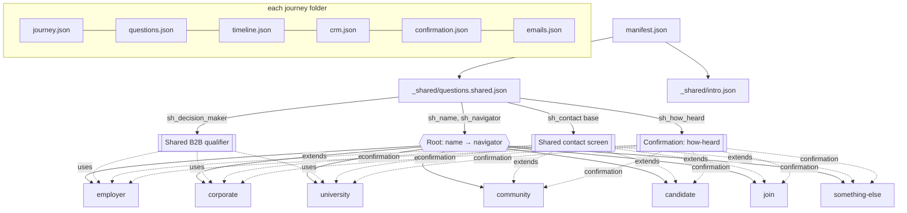
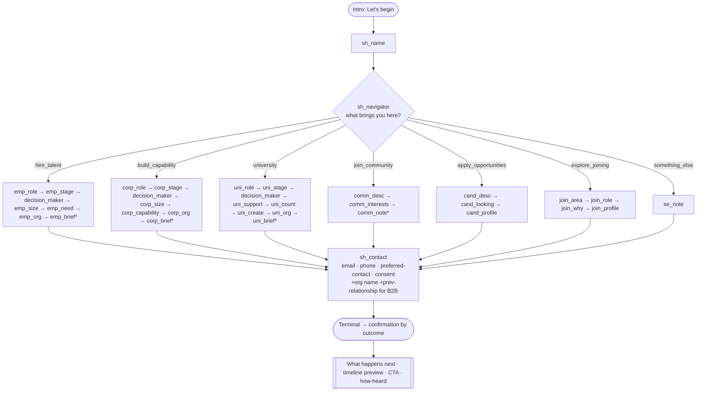
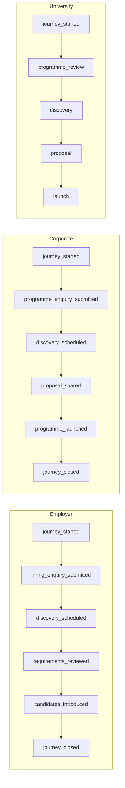
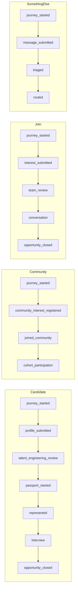

# Billbeak "Let's Talk" — Business Configuration Layer

This directory is the **product-modelling** output: the Billbeak-specific behaviour
that turns the generic Journey Engine into the "Let's Talk" experience. **No engine
code, no app code, no backend, no APIs** — only configuration and its documentation.

- **Source of truth:** the "Let's Talk" Journey Specification (verbatim copy honoured).
- **Consumes:** `@billbeak/conversation-engine` (unchanged) via `apps/talk` (unchanged).
- **Status:** ready for the next phase (backend wiring). See [Extension Points](#8-future-extension-points) for the small, documented additions the app/engine need to render the richer field types this spec introduces.

```
config/conversations/
├─ manifest.json                 Composition manifest (root + navigator + branch map)
├─ _shared/
│  ├─ intro.json                 Opening/welcome screen copy
│  └─ questions.shared.json      Root (name, navigator), decision-maker, contact base, how-heard
├─ employer/  corporate/  university/  community/  candidate/  join/  something-else/
│  ├─ journey.json  questions.json  timeline.json  crm.json  confirmation.json  emails.json
└─ README.md                     ← this document (deliverables 2–8)
```

Every journey is **self-contained**. Reuse happens through **composition** (`uses`,
`extends`, `sharedFieldSets`) — never copy-paste.

---

## Composition / loader contract

The engine loads **one** `FlowBundle` (`{ flow, questions }`). A build/loader step
composes it from these files. The loader is the next phase's job; its contract:

1. **Base questions** = `_shared/questions.shared.json.questions`.
2. **Root wiring** — master `flow.entry = sh_name`; `sh_name → sh_navigator`; then
   `sh_navigator` gets one transition per `manifest.navigator.branches[value]`
   using condition `{ op:"eq", path:"sh_navigator", value }` → the journey's
   `entryNode`.
3. **Per journey** — merge `<journey>/questions.json.questions` and inline every id
   in its `uses[]` from the shared set. Append the journey's `flow.nodes` to the
   master flow.
4. **`extends`** — a question with `"extends":"sh_contact"` is deep-merged onto the
   shared base; `overrides.config.addFields[]` entries (shared refs like
   `"sharedFieldSets.previousRelationship"` or inline field objects) are appended
   to the base `config.fields`.
5. **Terminals** — each journey ends at its own terminal (`outcome = <journey key>`);
   the app selects `confirmation.json` by that outcome.
6. **Validation** — the composed flow must satisfy the engine's `validateFlowConfig`
   (entry is a question, every transition target exists, every node's question
   exists, non-empty transitions). All chains here are total (single default edge)
   except the navigator (one edge per option + a default to `something-else`).

### File schemas (summary)

| File | Shape |
|---|---|
| `journey.json` | `key, name, description, icon, theme, priority, estimatedSeconds, supportedDevices, entryRoute, entryNode, completionRoute, journeyType, audience, version, metadata.persists[]` |
| `questions.json` | `{ purpose, uses[], flow{ id,version,entry,nodes }, questions{} }` — engine-native; questions add `config.suggestedAnswer`, `config.autoAdvance`, `config.persistAs`, `config.fields[]` (group), etc. |
| `timeline.json` | `{ journeyKey, lifecycle[], events[]{ type,label,trigger,emitNow,visibility,verification,evidence } }` |
| `crm.json` | `{ pipeline, ownerTeam, priorityBase, lifecycleStage, journeyStageField, tags[], leadScore{max,inputs[]}, routing[], automationHooks }` |
| `confirmation.json` | `{ title, body, whatHappensNext[], timelinePreview[], primaryCta, recommendedNextAction, howHeard }` |
| `emails.json` | `{ messages[]{ id,type,recipientRule,subject,variables[],delayMinutes,condition? } }` |

---

## 2. Journey dependency diagram

How the pieces depend on each other (composition, not runtime calls).



## 3. Journey branching diagram

The single composed flow. `sh_navigator` is the one real branch point; each path is
otherwise a linear chain into the shared contact screen and a per-path terminal.


`*` optional (Skip shown). Uploads appear only in candidate/join (profile) and the
optional B2B briefs — matching the spec's "uploads only for candidates, applicants
or visitors with briefs".

## 4. Timeline diagrams

Each submission emits `journey_started` + the path's submission milestone **now**
(from engine events); later milestones are emitted by the backend/CRM. These feed
the Timeline moat (ARCHITECTURE §4/§5/§15).





Solid = emitted now (`emitNow:true`): `journey_started` + the first submission event
on every path. The rest are `emitNow:false` (backend/CRM-driven). The Candidate path
is the deliberate spine to the **Talent Passport** (`passport_started`, `represented`
carry `verification` status).

## 5. CRM mapping documentation

| Journey | Pipeline | Owner team | Base priority | Lifecycle | Top score signals | Key routing |
|---|---|---|---|---|---|---|
| Employer | Talent Engineering — Hiring | talent_engineering | high | lead | journeyStage (already_hiring 40), orgSize, decisionMaker, roleBrief | ≥501 → enterprise_pod; already_hiring → urgent |
| Corporate | Corporate Programmes | corporate_programmes | high | lead | journeyStage (immediate 40), orgSize, decisionMaker | ≥501 → enterprise pod; senior_leadership → leadership_practice |
| University | Academy — University Partnerships | academy_partnerships | medium | lead | journeyStage (current_semester 35), audienceSize, supportAudience | current_semester → urgent; faculty → faculty_development_pod |
| Community | Community & Cohorts | community | low | subscriber | interests (cohort/fellowship 20), stage | fellowships → fellowships_list; cohort → waitlist |
| Candidate | Talent Engineering — Candidate Review | talent_engineering | medium | lead | cv 25, linkedin 20, portfolio 15, stage | portfolio → portfolio_review_queue; experienced → senior_talent_pod |
| Join | Billbeak Team — Inbound Interest | people_ops | medium | lead | cv 25, linkedin 20, portfolio 20, interestArea | area lead by interestArea; open → general pool |
| Something Else | General Enquiries — Triage | front_desk | medium | lead | message length, org presence | always → human triage |

**Metadata persisted on every Journey** (improvement #6): `journeyType, journeyStage,
decisionMaker*, preferredContact, previousRelationship*, leadSource, leadSourceDetail,
version, createdDate, updatedDate` (`*` B2B only). `journeyStage` maps to the
Journey entity's `lifecycle_state` context; `lifecycleStage` maps outward to CRM.

## 6. Question purpose documentation (validation)

Every question audited: **why it exists** and **who consumes it** — routing (R),
CRM/score (C), Timeline (T), AI/future (A), Talent Passport (P), analytics (An).

| Question | Journeys | Why it exists | Consumers |
|---|---|---|---|
| `sh_name` | all | Personalises every later prompt; the human contact name | R, C, An |
| `sh_navigator` | all | The one decision that routes the entire experience | **R**, C, T, An |
| `sh_decision_maker` | B2B | Prioritise & route by authority (improvement #2) | R, **C** |
| `sh_contact.email` | all | The operational must-have to respond | R, C |
| `sh_contact.phone` | all | Alternate/preferred channel; WhatsApp-friendly | C |
| `sh_contact.preferredContact` | all | Respect the visitor's channel (improvement #3) | R, An |
| `sh_contact.consent` | all | Lawful basis to contact (GDPR/DPDP) — **required** | Compliance |
| `previousRelationship` | B2B | Dedup & route existing relationships (improvement #4) | R, C |
| `sh_how_heard` | all (confirmation) | Attribution **after** submit so it never blocks the lead | C, An |
| `emp_role` / `corp_role` / `uni_role` / `join_role` | resp. | Editable self-description → routing nuance & warmth | R, C, A |
| `emp_stage` / `corp_stage` / `uni_stage` | B2B | Urgency & sequencing (improvement #1) | **R**, **C**, T |
| `emp_size` / `corp_size` | Emp/Corp | Deal shape & pod assignment | C, R |
| `emp_need` | Employer | The actual hiring requirement | R, C, T, A, P |
| `corp_capability` (chips+text) | Corporate | Programme shape & practice routing | R, C, A |
| `uni_support` / `uni_count` | University | Audience & scale (more useful than "team size") | R, C |
| `uni_create` | University | The academic requirement | R, C, A |
| `*_org` groups | B2B | Organisation identity → enrichment, dedup, Org entity | R, C, A |
| `*_brief` uploads | B2B (opt) | Lets the team review before contact | C, T, A |
| `cand_desc` / `cand_looking` | Candidate | Stage + intent for review & matching | R, C, A, P |
| `cand_profile` (≥1 of LinkedIn/CV) | Candidate | Evidence for Talent Engineering & Passport seed | **C**, T, A, **P** |
| `comm_desc` / `comm_interests` | Community | Segment the nurture list | R, C, An |
| `join_area` / `join_why` | Join | Route to area hiring lead; human signal | R, C |
| `se_note` | Something Else | Free-text intent for human triage | R, A |

**Removal recommendations:** none. Every question maps to at least routing, CRM, or
the Timeline/Passport. The design deliberately **avoids** low-value asks the spec
warned against — e.g. no "company size" for universities (audience/scale instead),
no separate email/phone screens (one contact screen), and attribution deferred to
post-submit. The only judgement calls are the three B2B qualifier selects added by
the improvements (stage, decision-maker, previous-relationship); each is a single-tap
auto-advance and each has a clear CRM/routing consumer, so they earn their place. See
[Assumptions](#7-assumptions) for the ~60s budget impact.

## 7. Assumptions

1. **Composition over one master flow.** The frozen app loads one flow and does not
   switch flows mid-session, so the seven journeys compose into a single master flow
   (root + navigator branch). Per-journey files stay self-contained; the loader
   stitches. (If instead you prefer per-flow loading, the same files work — the app
   would need a flow-switch, which is an app change, not a config change.)
2. **60-second promise.** Individual paths (community 45s, candidate 60s, join 55s,
   something-else 40s) hold easily. B2B paths run **~75–80s** because improvements #1,
   #2, #4 add three single-tap qualifiers. This is "about 60 seconds" in spirit; all
   added questions auto-advance. If strict 60s is required for B2B, the first cut
   would be `previousRelationship` (lowest routing value). Flagged, not removed.
3. **Preferred contact & previous relationship are folded into the contact screen**
   (fields), not extra screens, to protect the time budget while still persisting them
   as Journey metadata. Decision-maker and journey-stage remain standalone (they're
   routing-critical and benefit from focus).
4. **Editable suggested answers** are real starter text in the field (`config.suggestedAnswer`,
   `editableSuggestion:true`), not placeholder — per spec. Requires a small app renderer
   change (see extension points).
5. **Personalisation** — prompts carry `{firstName}` tokens; `sh_name` declares
   `capturesToken:"firstName"`. Interpolation is an app concern (extension point).
6. **Composite fields** (`type:"group"`) model the spec's multi-field screens (contact,
   org, candidate profile, chips+textarea) without an engine change: the group's value
   serialises to a JSON string (a valid engine `AnswerValue`), validated by a `group`
   validator registered in app config. One renderer + one validator cover all groups.
7. **Warm Billbeak theme** — journeys declare `theme.palette:"billbeak-warm"`. The app
   ships dark-first tokens today; the warm cream/brown/rust palette is a new token set
   (extension point). Config references it; it does not implement it.
8. **Routing/score expressions** (`"orgSize in [...]"`, `includesAny`, `perItem`) are a
   small declarative DSL for the backend to interpret. Shapes are defined; evaluation is
   the next phase.
9. **`journeyStage` naming** — Community/Candidate reuse `persistAs:"journeyStage"` for
   the "where are you right now" question since it is that path's stage signal; B2B use a
   dedicated stage question. Documented so analytics can treat them consistently.
10. **Copy is verbatim** from the specification (headline, options, suggested answers,
    disclaimers, confirmation messages, button labels). Where the spec implied but didn't
    spell out helper microcopy for the added qualifiers, neutral copy was written and is
    clearly the only non-spec text.

## 8. Future extension points

**App renderer/behaviour additions** (small, additive — do not change the engine):
- `group` question renderer + a `group` validator (covers contact, org, candidate/join
  profile with `requireAtLeast`, and corporate chips+textarea). Value = JSON string.
- `config.suggestedAnswer` prefill for text/textarea (editable starter text).
- `{token}` interpolation of prompts/help/suggested answers from captured answers.
- Rich confirmation screen rendering `confirmation.json` (what-happens-next, timeline
  preview, CTA, recommended action, post-submit `how-heard` that saves immediately).
- Pre-flow **welcome screen** from `intro.json` ("Let's begin").
- Navigator **visual grouping** (FOR AN ORGANISATION / FOR MYSELF) + option descriptions.
- Phone field with **auto country code** (default IN, editable); full-width buttons and
  numeric keyboard on mobile.
- **Billbeak-warm theme** token set (cream / dark-brown / rust) as a theme variant.

**Backend/next-phase hooks** (already declared in config):
- `timeline.json` events with `emitNow:false` — emitted by backend/CRM stage changes.
- `crm.json.automationHooks.future[]` — enrichment, matching, passport seeding, AI intent
  classification.
- `emails.json` `condition`/`delayMinutes` — follow-up and reminder scheduling.
- New journeys (Investor, Government, Media, Partner) = a new folder + one `manifest`
  branch. No app/engine change. This is the whole point.

---

### Deliverables index
1. Complete journey configuration — the 45 JSON files in this directory.
2. Journey dependency diagram — §2. 3. Branching diagram — §3. 4. Timeline diagrams — §4.
5. CRM mapping — §5. 6. Question purpose / validation — §6. 7. Assumptions — §7.
8. Future extension points — §8.
